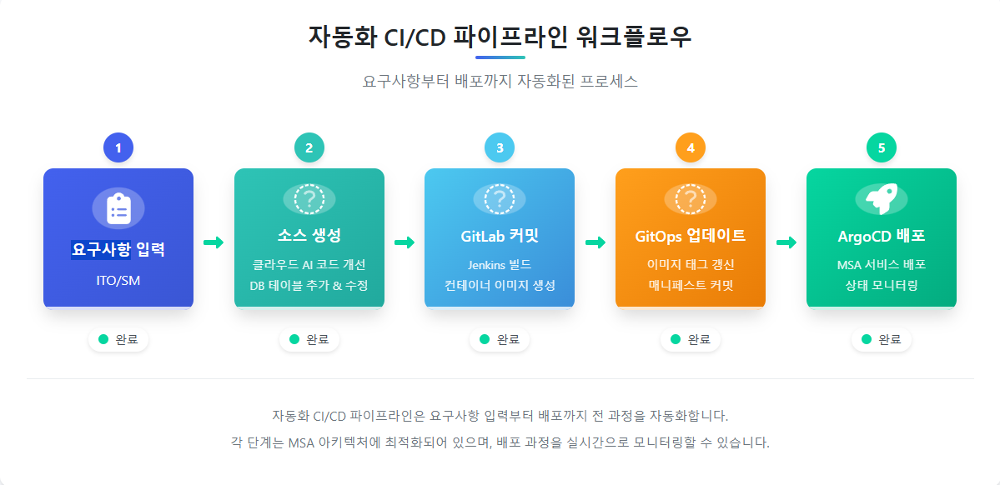

# 자동화 CI/CD 파이프라인 플랫폼

고객 요구사항 입력부터 AI 기반 코드 생성, GitLab 커밋, Jenkins 빌드, GitOps 태그 갱신, ArgoCD 배포까지 전체 CI/CD 파이프라인을 시각화하고 관리하는 프론트엔드 애플리케이션입니다.



## 🚀 주요 기능

- **요구사항 관리**: 고객 요구사항 입력, 조회, 수정 및 관리
- **AI 기반 코드 개선**: 클라우드 AI와 API 통합을 통한 자동 소스코드 개선
- **실시간 파이프라인 모니터링**: CI/CD 프로세스의 각 단계 실시간 추적
- **Git 통합**: GitLab 레포지토리 및 GitOps 자동 커밋 관리
- **배포 자동화**: Jenkins 빌드 과정 추적 및 ArgoCD 배포 자동화
- **시각적 워크플로우**: 전체 파이프라인 프로세스 시각화
- **대시보드**: 배포 상태, 통계, 시스템 상태 실시간 모니터링

## 🔄 워크플로우

1. **요구사항 입력**: ITO/SM팀이 고객 요구사항 입력
2. **소스코드 생성**: AI 기반 소스코드 생성 및 데이터베이스 테이블 수정
3. **GitLab 커밋**: 소스코드 GitLab 레포지토리에 자동 커밋 및 Jenkins 빌드 트리거
4. **Jenkins 빌드**: 소스코드 컴파일, 테스트, 컨테이너 이미지 생성
5. **GitOps 태그 갱신**: 생성된 이미지 태그로 GitOps 레포지토리 업데이트
6. **ArgoCD 배포**: 새 이미지로 MSA 서비스 환경에 자동 배포

## 💻 기술 스택

- **프레임워크**: Vue 3 (Composition API)
- **언어**: TypeScript
- **상태 관리**: Pinia
- **라우팅**: Vue Router
- **API 통신**: Axios
- **UI 컴포넌트**: 자체 컴포넌트 + Font Awesome
- **빌드 도구**: Vite

## 🏗️ 프로젝트 구조

```
src/
├── assets/            # 정적 리소스 (이미지, CSS 등)
├── components/        # 재사용 가능한 컴포넌트
│   ├── common/        # 공통 컴포넌트 (헤더, 사이드바 등)
│   ├── requirements/  # 요구사항 관련 컴포넌트
│   └── deployment/    # 배포 관련 컴포넌트
├── pages/             # 페이지 컴포넌트
│   ├── HomePage.vue
│   ├── requirements/  # 요구사항 관련 페이지
│   ├── deployments/   # 배포 관련 페이지
│   └── ...
├── router/            # Vue Router 설정
├── services/          # API 서비스 및 데이터 관련 로직
│   ├── api/           # 실제 백엔드 API 클라이언트
│   └── mock/          # Mock 데이터 서비스 (개발용)
├── store/             # Pinia 스토어
│   ├── modules/       # 도메인별 스토어 모듈
│   └── store.ts
├── types/             # TypeScript 타입 정의
└── main.ts            # 애플리케이션 진입점
```

## 🛠️ 모의 데이터 처리

현재 백엔드 서비스가 개발 중인 관계로, 프론트엔드 개발 및 테스트를 위한 모의(Mock) 데이터 서비스를 구현했습니다. 이는 실제 API와 동일한 인터페이스를 제공하여 추후 실제 백엔드로의 전환을 원활하게 합니다.

```typescript
// 모의 서비스에서 데이터 가져오기 예시
const requirements = await mockService.getRequirements();

// 실제 API로 전환 시
const requirements = await apiService.getRequirements();
```

## 🔧 설치 및 실행

### 필수 조건

- Node.js 18.x 이상
- npm 8.x 이상

### 설치 단계

```bash
# 저장소 클론
git clone https://github.com/your-username/autodeploy-frontend.git
cd autodeploy-frontend

# 의존성 설치
npm install

# 개발 서버 실행 (http://localhost:5173)
npm run dev

# 프로덕션 빌드
npm run build

# 빌드된 버전 미리보기
npm run preview
```

## 🖥️ 주요 화면

### 대시보드

실시간 배포 상태, 통계, 시스템 상태 등을 한눈에 볼 수 있는 메인 화면입니다.

### 요구사항 관리

고객 요구사항을 입력하고 관리하는 화면입니다. 요구사항 우선순위, 마감일, 상태 등을 추적합니다.

### 배포 모니터링

배포 파이프라인의 각 단계를 실시간으로 모니터링하는 화면입니다. 로그 추적, 오류 확인 등이 가능합니다.

## 🔄 상태 관리 아키텍처

Pinia를 사용한 상태 관리 구조로, 도메인별로 분리된 스토어 모듈을 구현했습니다:

- `requirement.store.ts`: 요구사항 관련 상태 및 로직
- `deployment.store.ts`: 배포 과정 관련 상태 및 로직

각 스토어는 작업 흐름에 따라 필요한 데이터와 비즈니스 로직을 캡슐화합니다.

## 📱 반응형 디자인

모바일 기기부터 데스크탑까지 다양한 화면 크기에 대응하는 반응형 디자인을 적용했습니다.

## 🔜 향후 계획

- [ ] 백엔드 API 통합
- [ ] AI 코드 분석 및 개선 기능 강화
- [ ] 테스트 자동화 구현
- [ ] 다국어 지원 확장
- [ ] 사용자 권한 관리 시스템 구현

## 🤝 기여 방법

1. 이 저장소를 포크합니다.
2. 새 브랜치를 생성합니다: `git checkout -b feature/amazing-feature`
3. 변경사항을 커밋합니다: `git commit -m 'Add some amazing feature'`
4. 브랜치에 푸시합니다: `git push origin feature/amazing-feature`
5. Pull Request를 제출합니다.

## 📝 라이선스

이 프로젝트는 MIT 라이선스 하에 배포됩니다. 자세한 내용은 [LICENSE](LICENSE) 파일을 참조하세요.

## 📞 연락처

프로젝트 관리자 - [dngktjd@gmail.com](mailto:dngktjd@gmail.com)

프로젝트 링크: [https://github.com/SeoJHeasdw/autodeploy-frontend](https://github.com/SeoJHeasdw/autodeploy-frontend)